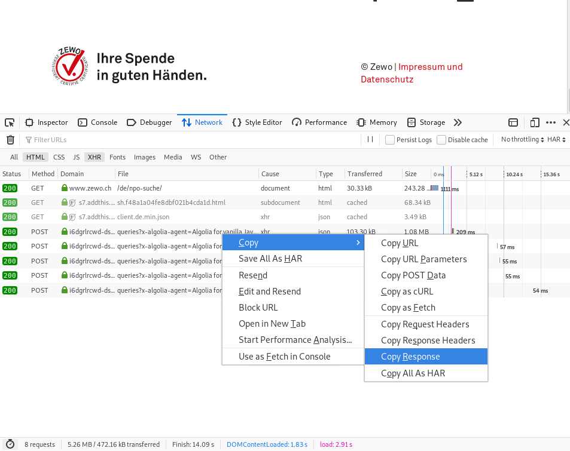

# Swiss Charities

This is a list of Swiss charitable organizations in the form of open data. We are crowdsourcing this data, please feel free to contribute to the `data/crowd.csv` file.

## Zewo data

We are also trying to contact Stiftung Zewo, who has a list of organizations registered with its certification program at https://www.zewo.ch/de/npo-suche/

Since this website is under copyright restriction, you can collect this data for **personal use only** by aggregating the data from the Algolia search API as per the instructions below.

(Whether or not you go through the steps) You can help us petition Zewo for permission to use the data via [Twitter](https://twitter.com/OpendataCH/status/1202506693038477312) or the [Community Forum](https://forum.opendata.ch/t/open-data-on-swiss-non-profits/606).

1. Open your developer console (F12 in Firefox), go to the web page above, and scroll down until all the results have been downloaded. In the Network tab filtering for XHR you should see five queries as in the screenshot:

2. Save the JSON results of each page as a file in the `data` folder of this repository: `p1.json`, `p2.json`, `p3.json`, .. The files have to start with a lowercase `p` and the order does not matter.

3. Run `make setup` if you have a Linux machine with `dnf`, or download and install the software listed in the `Makefile` yourself.

4. Run `make aggregate` to transform the data. If there are no errors, you will have a `data/data.csv` file that is ready to use with this Data Package.

## License

This package is licensed by its maintainers under the Public Domain Dedication
and License.

If you intended to use these data in a public or commercial product, please
check the data sources themselves for any specific restrictions.
